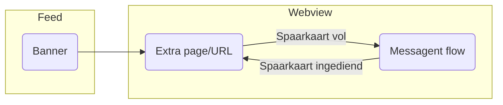

# Nieuwsblad Spaarkaart

## Commands

| Commands          |                                |
| ----------------- | ------------------------------ |
| `npm run dev`     | Run dev server locally         |
| `npm run build`   | Build result to `/dist` folder |
| `npm run preview` | Preview build result           |
